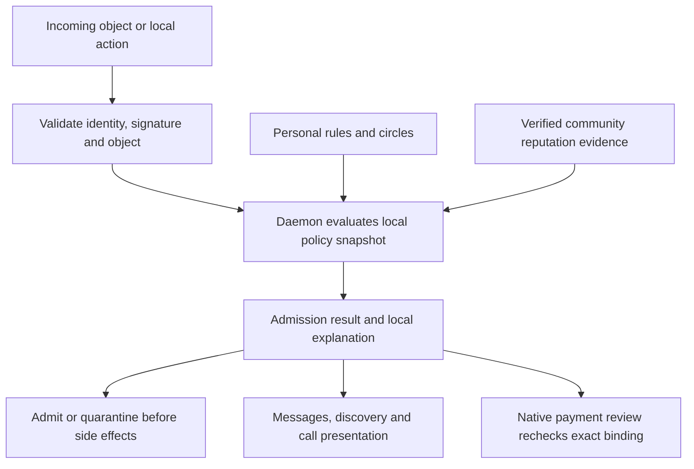

# Ring of trust — research and architecture proposal

Reviewer: Codex. Started 2026-09-16 against the
[owner's research scope](BB-TRUST-RESEARCH-SCOPE-01.md).
Status: owner product decision T1 recorded; reviewer selects the community-source,
aggregation and freshness architecture in section 3A. Wire/identity integration and
measured resource calibration remain prerequisites for implementation authorization.
No trust enforcement implementation is authorized. The account authority selection
and isolated verifier contract are now recorded in the account proposal and
[BBGO-ACC-001](../../../bb-go/tickets/BBGO-ACC-001.md), test-source phase only.
Codex has recommended returning to High after the owner's cost concern. This supersedes
the earlier direction to retain xhigh; no actual setting change is verified. Continue
bounded reviewer work without requiring an effort increase.

## Owner-selected behavior in plain language

Apply community reputation and allow/block judgments automatically through the trust
system, with personal circles, blacklists and whitelists available as overrides.
Automatically filtered content remains inspectable in a Spam/Filtered view. The user
can reveal an item, restore it or override filtering for the person. Ordinary use
must not require manually subscribing to each issuer's list.

Zero reputation means unknown/new, not bad. New accounts can use every implemented
feature under the same normal consent, protocol validation and recipient choices as
other accounts. Show others a clear reputation warning until sufficient evidence
develops. Do not impose a reputation threshold for messaging, posting, calling,
payment requests or normal wallet use. Limited behavior-based spam protection is
compatible with this requirement; exclusion simply for being new is not.

Being in a circle answers a particular question: “May this person message me?”,
“Do I use this person's spam judgments?”, or “Whose introductions do I consider?”
Following someone, accepting a payment request, trusting a relay and authorizing a
recovery helper are different decisions. A single reputation score cannot express them.

The owner expects broad community agreement on good and bad actors. Treat that as a
product expectation to support, not proof that a raw vote count or every signed report
is reliable. Section 3A defines the source authority, aggregation and warning rules,
including assumptions that cannot be established by counting signatures. No global
registry, mandatory operator or unchangeable community blacklist is selected here.

## T1: control over inherited rules

Owner decision recorded 2026-09-16: **B, with reversible filtering and full access
for zero-reputation accounts.** This supersedes the reviewer's earlier A recommendation
and the earlier proposed default quarantine/call restriction for unknown accounts.

| Choice | Behavior |
| --- | --- |
| A — earlier reviewer recommendation, not selected | Other people's lists act only after an explicit subscription to specified effects. |
| B — selected with the qualifications below | Community judgments act automatically; filtered content is reviewable and personal overrides remain available. |
| C | Personal circles and lists only; other people's rules never affect the user's interactions. |

Required qualifications:

1. Automatic adverse judgments normally move valid content to Spam/Filtered rather
   than make it irretrievable. Invalid signatures, malformed data and traffic exceeding
   resource limits may still be rejected; the folder cannot retain an unlimited flood.
2. Personal overrides can reveal/restore an item or allow the account for chosen actions.
3. Zero reputation permits normal use with an informational warning to others. It is
   not an adverse judgment, and accumulated positive reputation is not an entry fee.
4. Explore limited spam protection, without making ordinary newcomers earn feature access.

No further answer to T1 is needed. N1 is provisional with owner reservations and is
not a project gate; the account proposal records the latest direction to continue.
Source selection, aggregation and limits are reviewer engineering work, not delegated
to the owner.

## 1. What the existing research and code establish

The workspace's `Distributed Social Media Research.md` already discusses moderation
at lines 94–118 and shared labels/web-of-trust ranking at 214–226. It did not specify
BitBook's rules. Its suggestion that graph-based ranking renders fake reviews
ineffective is not an accepted guarantee. Marketplace examples do not restore
marketplace scope. The private workspace planning document remains unpublished.

Read-only source baselines: bb-go `cd497749a771b063300e2c3edf8748fe285b06c4`;
bb-desktop `0ecfbc45aa30dee94918c98cbf1e46aaf112d64f`.

| Current surface | Observed behavior | Architectural consequence |
| --- | --- | --- |
| Daemon `modern/direct/service.go:402` | Verifies a signed peer envelope, then processes follows, chat, typing and read events. | Authentication exists. There is no account trust-policy decision in this admission path. |
| `modern/direct/service.go:341` | Retries delivery using the stored peer recipient. | New policy must be checked again before queued delivery, not only when composing. |
| `modern/payment/service.go:287` | Verifies payer/payee/signature, linkage, replay and expiry before retaining records. | Add policy after identity/object validation and before admitting new requests; preserve those existing checks. |
| `modern/social/store.go:197,310,365` | Follows, profile fetches and signed-post authorship use peer identities. | Follow relationships cannot silently become trust endorsements. Public content retrieval and display need separate policy decisions. |
| `modern/api/handler.go:47` | Social routes include wildcard CORS; no trust management route is present. | Do not add sensitive policy mutation by copying this surface. |
| `modern/localclient/server.go:194` | Authenticated loopback read endpoint rejects browser Origin and accepts only GET records. | Useful boundary pattern; write authorization, anti-replay/concurrency and policy events need a new contract. |
| `modern/network/node.go:93` | Configures libp2p, DHT and Bitswap; includes DHT peer-diversity filtering. | Routing defenses are distinct from human/account trust and must remain independent. |
| Desktop `social/app.js`, `social/payment-inbox.js` and `wallet-pay/inbox-client.js` | Messages/request cards are grouped and validated by peer identity. | Display verified policy results; do not make the renderer the sole enforcement point. |
| Legacy `net/ban_manager.go`, `net/service/service.go:87`, `api/jsonapi.go:3301` | Has a peer-ID ban map, stream rejection and persisted blocked-node settings. | Historical behavior is a reference only; it is not an extensive trust system in the maintained modern daemon. |

Inspection and targeted searches found no current modern circles, shared policy-list
subscriptions or trust evaluator. This is source inspection, not runtime verification
of an installed daemon. Inspected product sources match the baselines; unrelated
existing edits, including modern README and wallet work, are preserved.

## 2. Research comparison

Primary sources checked 2026-09-16. These are behavior/design references, not approved
dependencies. Each takeaway below is the reviewer's inference for BitBook.

| Source | What it provides | Takeaway and limit |
| --- | --- | --- |
| [GnuPG trust models](https://www.gnupg.org/documentation/manuals/gnupg/GPG-Configuration-Options.html) | Separates key validity and trust in an introducer; supports several trust models and bounded certification depth. | Separate identity evidence from permission to introduce others. OpenPGP identity certification is not a complete social reputation or blocking policy. |
| [Scuttlebutt following and graph](https://ssbc.github.io/scuttlebutt-protocol-guide/#following) | Directed follow relationships; clients can choose different visibility and replication distances. | A graph can organize rings while display and network replication remain separate. Its public follow graph would reveal relationships that BitBook should allow to remain private. |
| [Nostr NIP-51](https://github.com/nostr-protocol/nips/blob/master/51.md) | Lists with public and encrypted private entries, including mute lists and named sets. Draft/optional. | Distinguish private personal lists from intentionally shared ones. Its encrypted-to-self format does not solve BitBook's independent-device key sharing. |
| [Nostr NIP-85](https://github.com/nostr-protocol/nips/blob/master/85.md) | Signed assertions from providers the user selects for particular result types. Draft/optional. | Keep issuer and purpose attached to an assertion. A signature authenticates the provider, not the truth of a score; no required scoring service. |
| [AT Protocol labels](https://atproto.com/specs/label) | Signed issuer/subject/value annotations with retraction and expiry; optional content-version binding. | Separate claims from the policy consuming them. Retraction is not an opposite endorsement. Do not copy timestamp ordering as our multi-device conflict solution. |
| [Matrix community moderation](https://matrix.org/docs/communities/moderation/) | Shareable lists, explicit subscriptions and different lists for different purposes. | Explicit subscription can automate useful action while preserving scope. A room/server moderator's authority is different from a BitBook user's personal authority. |
| [EigenTrust, original paper](https://nlp.stanford.edu/pubs/eigentrust.pdf) | Aggregates file-sharing experience into a global reputation measure; its algorithm uses pre-trusted peers to address malicious collectives. | A numerical graph metric brings assumptions about seeds and evidence. Do not import a global score or network-wide trusted operators as BitBook's permission model. |
| [Douceur, The Sybil Attack](https://www.microsoft.com/en-us/research/publication/the-sybil-attack/) | Explains why multiple identities can undermine systems that assume independent participants. | Many keys, endorsements or paths need not mean many independent people. This motivates bounded influence; it is not a proof that our proposed controls defeat all fake-account attacks. |

The useful combination is personal lists/circles, authenticated community assertions
and a local decision engine. T1 selects automatic effects with reversible filtering.
No reviewed system eliminates policy choice, privacy
tradeoffs, compromised trusted users or the need for resource limits.

## 3. Model: circles, introductions and authority

Use “ring” in the product as an understandable view over these distinct concepts:

| Concept | Meaning | Does not imply |
| --- | --- | --- |
| Named circle | An owner-managed set such as Friends, Work or Local community; membership may overlap. | Members know each other, endorse each other, or receive every permission. |
| Personal blacklist/whitelist | The owner's filter/allow choice for a typed target and specified actions. | A public accusation or an identity/key-validity judgment. |
| Introducer | An account the owner chooses to recommend other accounts for a stated purpose. | General permission to select recovery keys, spend money or change local policy. |
| Introduction distance | A derived view of eligible directed endorsement paths from the owner. | Authority over the owner, or a count of independent humans. |
| Shared list/label | An issuer's signed claim, with subject, scope, version and optional reason/expiry. | Truth by signature alone, unlimited authority or a network-wide ban. |
| Community policy | The sources/rings and versioned aggregation rules used automatically for reputation and filtering. | Every network account getting one independent vote or power over recovery/spending. |
| Source subscription | The mechanism for retrieving community policy's sources, with optional personal additions/removals. | A required manual setup step for every ordinary user or unrestricted scope expansion. |

Recommendation: automatic reputation/filtering is the default experience. Named circles
and source settings offer personal control; introduction distance is an optional
discovery aid. A person can be trusted for technical introductions but filtered for calls.

Community reputation may use signed endorsements and feedback about identified
accounts/content, with reasons, issuer provenance and retractions. Account age, traffic
volume, number of keys and circular endorsements must not by themselves establish a
good reputation. Private messages and payment activity are not automatically published
as reputation evidence. Section 3A defines eligible assessments and expiration.

Use bounded influence and traversal. The earlier two-edge introduction model is a
candidate for discovery only, not the selected community-reputation algorithm. Do not
count cycles, mirrored lists or repeated paths as independent agreement. Distinguish
unknown, established positive evidence, adverse evidence and disputed/stale evidence;
they must not collapse into one number where missing evidence becomes negative.

Automatically incorporating eligible judgments about Carol is different from filtering
Carol merely because she knows Bob. Do not spread guilt by association through every
follow edge. Lists and endorsements feed a bounded, explainable community evaluation;
one arbitrary accusation is not automatically community consensus.

## 3A. Selected community evaluation architecture

Reviewer decision, 2026-09-16, based on the owner's instruction to continue. This
selects engineering semantics; it does not attribute these details to the owner or
authorize source work. Review baseline: bb-desktop `439bb762e7eae71859081e85035e97c9a279edad`;
the daemon baseline in section 1 is unchanged.

### Why this model

Use **local evaluation of signed, scoped assessments from a replaceable community
profile**, with bounded, explicit delegation. A profile supplies the starting sources
automatically, so a new user needs neither contacts nor a list-setup exercise. Each
source has a limited contribution; ordinary follows, likes and positive reputation
cannot create new assessment authority. Different users can choose different profiles.

This adopts the separation between assertions and their consumers illustrated by
[NIP-85](https://github.com/nostr-protocol/nips/blob/master/85.md), and the issuer,
subject, retraction and expiration concepts in [AT Protocol labels](https://atproto.com/specs/label).
Neither specification supplies our aggregation algorithm. The
[Sybil paper](https://www.microsoft.com/en-us/research/publication/the-sybil-attack/)
motivates making starting trust assumptions explicit. [EigenTrust](https://nlp.stanford.edu/pubs/eigentrust.pdf)
likewise relies on pre-trusted peers; its file-transfer score is not selected here.
These primary sources were revisited on 2026-09-16.

| Alternative | Decision and reason |
| --- | --- |
| One vote per account, popularity or stake | Reject for filtering: accounts can be fabricated; popularity and money do not establish good judgment. |
| Automatic propagation through all follows or positively rated accounts | Reject: endorsement cycles would create new assessment authority. |
| One required remote scorer | Reject: an outage or one compromised scorer must not determine everyone's inbox. |
| Unrestricted global graph score | Defer: harder to explain, synchronize and bound; graph position is not evidence for a specific accusation. |
| Bounded sources, explicit delegation and local quorum | Select: makes each source's power and the failure assumptions inspectable. It still requires trustworthy starting sources. |

### Bootstrap and source authority

A **community profile** is signed data identifying its purpose, version, predecessor,
source groups, update keys, permitted categories and evaluator version. Ship a reviewed
default profile with the client. Peers and caches may distribute identical signed
copies; the peer returning a copy acquires no authority. A profile can be replaced or
disabled in advanced settings, and ordinary account use continues without it.

The initial evaluator permits 3–32 configured source groups. The launch profile targets
**five separately controlled groups**. Each group contributes at most one unit to an
assessment. Multiple accounts, keys, devices, mirrors or lists operated by one known
controller belong to one group. This classification is a reviewed governance claim,
not cryptographic proof that operators are independent people. Do not discover new
trusted roots by asking random peers which accounts are most popular.

Each group identifies one accountable source account. It may directly assess a subject
or explicitly authorize up to 32 assessor accounts for named categories. Delegations
expire, cannot be delegated again, and grant assessment rights only. This is one
authority edge from a configured source to an assessor, followed by that assessor's
judgment about a subject. An endorsement that someone is a good participant is a
different record and grants no right to judge others. Group controllers can themselves
consume ordinary community reports; signing an assessment accepts responsibility for it.

Circles remain freely editable and overlapping. Personal rules retain section 4
precedence. Following someone or adding them to Friends does not silently insert them
into the profile. Optional alternative profiles apply independently by purpose; two
profiles containing the same sources must not be stacked to manufacture a quorum.
The first evaluator uses one active community profile per purpose. Personal source
edits form an explicit local profile fork; remote updates cannot overwrite those edits.

**Launch requirement:** retain the actual source accounts, controller relationships,
update keys, consent to serve and stated assessment policies in a reviewed public
profile before enabling the default. No such roster has been established by this
research. Do not invent five identities, recruit actors without authorization, or ship
developer test keys as a community. Before that roster exists, show reputation as
unavailable and preserve full ordinary use, personal rules and spam budgets. That
state is not completion of the requested automatic community feature.

### Profile updates and compromised sources

Keep profile-update authority separate from routine assessment-signing keys. Require
a strict two-thirds quorum of configured groups for roster/key updates, with signatures
under both the old and new update-key sets when replacing them. Persist the version
and predecessor; reject rollback, skipped continuity, conflicting successors and
unsupported evaluator versions. The threshold is `floor(2*N/3) + 1`, where `N` is the
configured group count; five groups require four signatures. Count a controller once.
Do not reduce the threshold because some keys or sources are offline.

The [TUF specification](https://theupdateframework.github.io/specification/latest/)
provides the reference for pinned bootstrap metadata, threshold key transitions,
version checks and expiration. This selects those update requirements, not a custom
cryptographic primitive or a TUF dependency. Exact metadata encoding and library fit
belong in the shared identity/wire contract. A valid update may rotate sources within
the supported social-policy boundary; it cannot grant spending, recovery, deletion or
private-data publication rights. New program semantics require a reviewed application
update. Personal overrides survive every profile revision.

If conflicting profile successors are observed, retain the last unambiguous profile,
mark updates conflicted and honor its existing expiration. Resume only through an
explicit authenticated resolution that references both forks. A compromised assessment
key invalidates that group's affected contributions immediately when verified evidence
arrives. Other groups and personal rules continue. Losing enough update keys prevents
automatic roster repair; an explicit locally authorized profile replacement is the
recovery path. A malicious update quorum can poison its profile: users' ability to
inspect, override or replace it is essential, not a proof that this attack is impossible.
An adverse social label about an assessor does not itself revoke assessment authority
or remove a source group from the denominator. Use authenticated authority revocation,
profile updates or an explicit personal source change; reputation cannot elect its own
judges or expel dissenting sources recursively.

### Eligible evidence and how reputation develops

Assessments bind issuer, delegated authority, subject type/ID, category, scope,
operation ID, predecessor, assessment time, expiry and evidence references/reason.
Use separate categories for participation standing and specific adverse behavior.
Initial adverse categories are unsolicited spam, impersonation/deception and targeted
harassment, with explicit affected surfaces. Topic, viewpoint or taste labels do not
silently acquire automatic blocking effects. One objection to a post does not become
an account-wide judgment; those are different signed targets and scopes.

An eligible assessor may endorse participation after meaningful interactions, or assess
a report against the identified account/content. An ordinary user can report, endorse
or retract without being an eligible assessor. Their publication reaches interested
community assessors but supplies no extra quorum unit by itself. Reporting is a
deliberate sharing action; personal Block/Allow, local message history, payment amounts
and private bodies are never automatically published. Public reason text is untrusted
data; render safely and never fetch its links or attachments automatically.

Evidence may be the same authenticated public item inspected by several assessors.
Count their accountable assessments, not the number of copies or claimed incidents.
A forwarded assessment keeps its original issuer; countersigning a transport wrapper
does not make it a new opinion. An assessor asserting an independent assessment signs
that fact and its basis. Hidden coordination or dishonest claims of independent review
cannot be detected from signatures alone. The trust bound is about authorized source
contributions, not a guarantee that accusations are true.

For each issuer/subject/category/scope, retain one current causally ordered assessment:
support, adverse, clear-the-specific-allegation, or abstain, as appropriate to category.
Concurrent contradictory versions make that issuer abstain for the affected slot until
resolved. Retraction removes the cited claim; it is not a positive endorsement. General
positive reputation cannot cancel a current, independently qualifying adverse category.
Renewals keep their evidence provenance; re-signing old evidence is not a new incident.

### Deterministic aggregation

Evaluate an immutable snapshot containing the profile revision, verified source state,
complete relevant assessment data, personal-policy revision and evaluation time.
Fetching data is background synchronization; no remote scoring call occurs inside
admission or native payment approval.

1. Apply validity, authority, scope, freshness and resource checks. Unknown categories
   have no automatic effect. Missing/corrupt/oversized data makes the affected source
   contribution unavailable. Self-assessments and assessments by a known controller
   of the subject do not contribute to its standing or clearance. Never trim away
   inconvenient opposing records and then claim a complete result.
2. Within each group and category, a current direct source assessment takes precedence
   over its delegates. Direct abstention contributes nothing. Otherwise, consider the
   authorized delegates: conflicting current opinions make the group abstain for that
   category; agreeing opinions supply candidate issuers for one group contribution.
3. Deduplicate actual issuer accounts and declared common-control groups across source
   paths. Compute the maximum number of group-to-issuer assignments with each group
   and each issuer/controller used at most once. This is a bounded bipartite matching,
   not a count of graph paths. Sort identifiers for a deterministic explanation when
   several equally sized assignments exist. A delegate shared by four groups can
   therefore contribute only one unit, even through four valid delegations.
4. For each adverse category and scope, filter only if adverse assignments reach
   `Q = floor(2*N/3) + 1`. Calculate `N` from the configured profile, never from the
   currently responding sources. Five groups require four contributions. Abstention,
   expiry, a missing shard or a removed local source cannot lower the existing quorum;
   changing the roster is an explicit profile change.
5. Established community participation requires the same quorum of current positive
   participation assessments. Below-quorum allegations cannot independently quarantine
   content or remove feature access. Show coverage and disagreement in the explanation;
   avoid amplifying one accusation into a prominent bad-actor badge. Qualifying adverse
   categories take precedence over a general participation badge on affected surfaces.
6. Apply personal rules/overrides and presentation as section 4 specifies. Return the
   evidence revision, counted groups/issuers, excluded or missing inputs, expiry and
   reason. Persist the decision revision with admitted content and notify the UI.

These thresholds are a conservative reviewer-selected starting policy, not values
measured against a real community. With five genuinely separate roots, fabricated
accounts under one or two roots cannot alone reach four contributions. Four dishonest
or fooled roots still can. Two unavailable roots can prevent a decision, so false
negatives are an intentional cost of requiring broad agreement. No account is denied
ordinary use for lacking that agreement.

Positive reputation spreads through explicit assessor delegation and assessments,
without recursively promoting every endorsed person into an assessor. A local user
may additionally mark someone personally known; the UI says “Known to you” rather
than inventing community agreement. Interaction counts, days online and money sent
are never automatic substitutes for the required evidence.

| Five-group example | Result |
| --- | --- |
| Four distinct eligible issuers in four groups assess spam | Filter to Spam; show those judgments and allow personal override. |
| Ten thousand reports enter through one source group | At most one contribution; no community filter. |
| One assessor is authorized by all five groups | At most one contribution, not five. |
| Two groups assess spam, three are offline | No quorum; ordinary use with incomplete reputation context. |
| Four endorse participation; one alleges spam | Established participation; allegation is inspectable but cannot alone filter. |
| Four endorse participation and four separately assess a current spam category | Filter that scope; positive standing cannot wash away adverse evidence. |
| Four qualifying spam assessments become three after a retraction | Remove community filtering, unless another active rule applies; no replayed alerts or actions. |
| User always-allows a person who meets the community spam threshold | Personal exception wins within its scope; retain the reason/context. |

### Freshness, decay and bounded synchronization

Use expiring assessments rather than an opaque continuously decaying score. Initial
reviewer-selected profile values are below. They are engineering starting limits;
later acceptance must measure the mobile/desktop load and false-positive behavior.
Any changed values must be recorded before implementation acceptance.

| Item | Initial contract |
| --- | --- |
| Positive and adverse assessment | Maximum 30 days from signed assessment time; earlier explicit expiry wins. A renewal is a new causally linked assessment, retaining incident provenance. |
| Assessor delegation | Maximum 30 days; explicitly renewed/revoked by its source group. No onward delegation. |
| Source checkpoint | At most 72 hours of validity; an online publisher should renew at least every 24 hours. A checkpoint cannot extend an assessment's own expiry. |
| Profile metadata | At most 180 days; roster continuity and update quorum still required. Expiry suspends community-derived effects, not personal choices or account access. |
| Clock allowance | At most five minutes of future skew. Persist an observed time floor; significant rollback/uncertainty produces unavailable reputation until corrected, never a new permanent ban. Local clock correctness remains an explicit assumption. |
| Refresh | Consume authenticated update hints with coalescing; reconcile every 15 minutes while online, and on reconnect/resume. Hints are not evidence. Mobile suspension/partitions can delay receipt. |
| Graph work | At most 32 groups and 32 direct delegates per group; no recursion. At most 1,024 delegated issuer slots per subject/category before deduplication. |
| Data budgets | At most 8 KiB per assessment, 256 KiB per metadata object and 4 MiB per fetched chunk; 64 MiB community cache per device for the initial profile. Enforce decoded limits as well as transport limits. |

The effective expiry is the earliest relevant claim, delegation, source checkpoint,
profile or authority expiry. There is **no extra grace period for automatic filtering**.
Recompute on retraction, revocation, source/profile/personal-rule change and expiry,
including while offline. Timers must not depend on receiving another message.
Persist source high-water marks and retractions across restart and cache eviction;
never revive an older snapshot because a newer chunk disappeared. Wall-clock rollback
cannot refresh evidence. Monotonic elapsed time bounds validity during a running
session; reboot cannot prove elapsed time or discover unseen revocations.

Sources publish authenticated, versioned snapshots/deltas in bounded content-addressed
chunks. Fetch by profile/source data, not by sending a private contact list to a scorer.
Subject sharding is allowed, but the wire contract must define verifiable completeness
for the relevant shard, including delegate conflicts, removals and generation binding.
No mixed-generation evaluation. An incomplete shard makes that group's contribution
unavailable; cached valid complete data may serve only until its original expiry.
Cache budget or source overload does not evict personal rules or extend negative claims.
Sharded retrieval can reveal interest in a subset of subjects; this is not a promise
of anonymous network access. Private policy is synchronized only between authorized
devices through the separate encrypted channel.

Absence of an assessment is not an authenticated claim that someone is good. While
eligible data is incomplete, show unavailable/partial coverage; continue normal use
unless valid evidence still reaches quorum or a personal restriction applies. A new
account can participate on day one even if no community source is reachable.

### Acceptance obligations before activating the community profile

Retain source-authored cases for the example table plus source/delegate overlap,
common controllers, conflicting delegated opinions, full-versus-partial shards,
equivocation, expiry without traffic, clock rollback, retraction after restart,
compromised keys, source removal, profile-fork resolution, disconnected devices and
personal overrides surviving profile updates. Include a load case where one authorized
source fills its budget without starving personal-rule enforcement or control messages.
These are requirements, not executed tests or evidence of measured performance.

Before public activation, supply the real source roster and calibrated limits, bind
authority and serialization to the selected identity method, and retain execution
evidence for those cases. No new product choice is delegated to the owner here.

## 4. Actions, defaults and precedence

Proposed scopes are distinct. Exact names are illustrative until the protocol contract:
content visibility, discovery recommendations, incoming messages, attachments,
call invitations, payment requests, outgoing interactions and infrastructure use.
Account administration, policy editing, device enrollment, recovery and wallet spending
use explicit capability authorization outside this social-policy decision.

For each authenticated operation, compute both admission and presentation. Admission
is allow, hold for review or reject. Presentation can show normally, warn, mute or hide.
Content ranking is separate. “Hide” must not accidentally grant or revoke a capability.

Defaults implementing the owner's product decision:

- An unknown account can post, appear in discovery and send messages/payment requests
  normally, with “No established reputation yet” shown to others. Zero reputation alone
  does not send these items to Spam, suppress ordinary notifications or disable actions.
- Calling remains available to newcomers when implemented. Calls can ring with the
  warning under normal recipient preferences; camera/microphone use always requires
  ordinary acceptance. Reputation is not a separate invitation requirement.
- Sufficient adverse evidence from the automatic community policy filters otherwise
  valid content. Show it in Spam/Filtered with the reason, sources and review controls.
  Filtered call invitations do not ring; retain a bounded entry, not recorded media.
- Reading a filtered payment card does not approve or send money. Restoring it makes
  the normal native-review action available, subject to current validity and expiry.
- Positive reputation can remove the newcomer warning when its evidence qualifies;
  it never unlocks special wallet, device or recovery authority. A lookup outage shows
  “Reputation unavailable,” not “bad actor” or fabricated positive standing.
- Personal Block/Allow/Mute and optional tighter recipient preferences remain. Default
  personal Block suppresses new interactions into the reviewable filtered view and
  stops outgoing retries. An explicit stronger reject-traffic control, if added, must
  explain that rejected bodies cannot appear there. Mute only changes presentation.
- Feature access does not mean unlimited message volume. Bounded, recoverable rate limits
  apply to abuse/overload without requiring endorsements to participate.

### Proposed precedence under owner-selected T1

| Order | Rule | Conflict behavior |
| --- | --- | --- |
| 0 | Cryptographic validity, recipient binding, schema, device authority and hard resource limits | Policy cannot permit an invalid object or a revoked/unauthorized device. |
| 1 | Owner's explicit all-social block on the target account | Wins over social allows; normally filters rather than discards valid content. Unblocking must explicitly resolve it. Control-object handling is described below. |
| 2 | Owner's exact target/action decision | Overrides circle rules, community policy and defaults. Concurrent incompatible decisions are restricted pending resolution. |
| 3 | Owner's circle rules for that action | Filtering beats allow in a conflict; explicitly chosen reject-traffic rules are stronger. UI previews conflicting memberships. |
| 4 | Automatically evaluated community policy and personal source settings | Qualifying adverse evidence filters to Spam; conflicting/insufficient evidence is explained. Raw report counts and arbitrary single reports do not establish consensus. |
| 5 | Normal action default | Unknown/zero reputation allows normal use with a warning. No positive trust path is required. |

An exact personal message allowance can override a community-derived spam restriction
for messages without overriding a full personal Block or allowing calls. An allowlist
entry does not bypass signatures, expiry, wallet confirmation, quotas or device authority.
Removing an inherited denial falls back to the remaining rules, not an implied whitelist.

Community policy is active by default. Its source discovery/bootstrap, aggregation,
freshness and maximum effects must be inspectable, versioned and user-changeable;
ordinary users should not configure each constituent list. Changing sources/retracting
claims automatically recomputes derived results without overwriting personal rules.
Section 3A defines that default and its real-roster activation prerequisite.
Community updates cannot expand from reversible social filtering to spending, account
recovery, private-data publication or destructive deletion. List data cannot execute
scripts or unrestricted matching rules. Personal imported rules still get a preview.

### Spam/Filtered review and override contract

Provide a clearly discoverable Spam/Filtered view for affected messages, payment cards
and encountered public content, with access from their normal surfaces. This is not
the removed standalone payment Requests tab. Public results can retain a verified
reference/preview and fetch on deliberate reveal; do not promise a complete archive of
the network. Store bounded message bodies where accepted; expose retention/overflow
and unavailable/expired content honestly.

Offer **View once**, **Restore this item**, **Always allow this account** (with scope),
and **Keep filtered**. Viewing once does not whitelist, publish a counter-rating, emit
a read receipt, load remote media or reopen calls. Restoring does not auto-pay, resume
an old outgoing queue or launch an expired call. A personal override persists across
community-list refreshes and, once synchronized, across authorized devices. New
community evidence may remain visible as context but cannot silently erase it.

Retractions and improved standing re-evaluate filtered items. Releasing them does not
replay old alerts, ring old calls or execute queued actions. A historical label can
remain in the audit explanation without remaining an active restriction.

## 5. Enforcement and protected control messages

Apply policy before normal persistence, notifications, receipts, attachment fetching
and call signaling side effects. Spam storage is separate from the normal conversation;
automatic reputation filtering retains reviewable valid content within its limits.
Unknown reputation alone takes the ordinary path with a warning. Rate limits apply
before expensive verification, and further limits apply to authenticated accounts and
accepted objects. Reject malformed data rather than putting it in a review queue.

Recheck outgoing queued messages on every attempt. Changes invalidate cached policy
results and trigger UI events; missed events use snapshot/cursor reconciliation. A
policy decision carries its policy revision, evidence references and freshness state
so the same snapshot can be explained and reproduced.

Locally serialize a policy update with admission/side-effect commitment, or check the
policy revision again under the same commit boundary and retry the decision. A block
must not return “applied” while an older queued decision can still start a new local
send, notification or call. Define the boundary for already-started network operations;
bytes already transmitted cannot be recalled. This local race guarantee does not imply
simultaneous enforcement on disconnected devices.

**Do not drop every object from a blocked account indiscriminately.** A valid
cancellation of an already-held request must still make that request unpayable.
Likewise, required authority revocations, list retractions and protocol teardown need
bounded handling even when ordinary social traffic is denied. These control objects
must be authenticated, restricted to their exact existing relationship/object and
unable to smuggle chat text, attachments, new requests or notifications. Reserve
separate quotas so an attacker cannot bypass blocking by claiming a control kind.
Fetching authority evidence from other peers does not itself authorize contact.

The peer-visible acknowledgement must not disclose private list names, introducers
or block reasons. Its new protocol semantics must not claim user-visible delivery
merely because a quarantined object was stored. A peer may still infer restrictions
from behavior; blocking does not promise invisibility.

Infrastructure connection gating remains separate. A social block governs the
authenticated author/account even when data comes through a relay or third-party
cache. Relaying public data is not endorsement of its author. An explicit connection
ban on a peer/service can reduce reachability and needs separate presentation; using
only social friends for DHT routing could make isolation attacks easier. Preserve
v1's existing live-peer checks; relay/account semantics require a new protocol.

## 6. Data, privacy and synchronization

### Semantic records (not wire schemas)

Separate owner policy, other people's assertions, and derived decisions. Minimum
bindings for portable records:

| Record | Required meaning |
| --- | --- |
| Personal rule/circle edit | Owner account, authorized policy-writer device, typed subject(s), action/effect, causal predecessors and stable operation ID; private by default. |
| Endorsement or label | Issuer account and delegated signing authority, typed target/account or content digest, purpose/value, audience, operation ID, causal version and retraction/expiry semantics. |
| Shared list | Stable list identity under issuer, declared purpose, versioned membership/claims and verified update history. |
| Community policy/source settings | Community-view identity/version, eligible sources/roots and aggregation rules, effect ceiling, freshness handling, optional personal subscriptions/overrides and bounded delegation. |
| Reputation result | Account, assessment scope, source coverage, supporting and adverse evidence, freshness and policy version; unknown must remain distinct from adverse. Coverage is not a calibrated probability of truth. |
| Evaluated decision | Subject/action, outcome, effective policy revision, considered evidence and a local explanation; reproducible cache, not an authority certificate. |

Target types must distinguish account, legacy peer, content version and infrastructure
service. No matching by mutable display name or current IP address. The account can
represent a human or a specialized service without requiring a human profile.

Use a versioned, domain-separated authenticated record format, with strict field/size
bounds and explicit extension handling. Reuse the chosen account-authority verifier
and established signing/encryption implementations; this proposal invents no new
cryptographic primitive. Merely verifying an issuer's signature does not authorize
that issuer to change local rules. Public profile JSON must not be an alternate
policy-write path.

### Private by default

Keep personal blocks, circles, reasons and subscriptions private to authorized devices.
Sharing a list or endorsement is a separate action with an audience preview. Do not
publish private data in the profile root, public DHT or public Bitswap blocks. Private
replication needs authenticated encryption and distinct device access controls; it
cannot reuse NIP-51's shared-secret pattern by copying the account key onto every device.

A public accusation can persist after retraction; revocation cannot erase copies.
Explanations shown to the local user may name their private sources, but remote peers
receive no such details. Avoid querying arbitrary list providers with every contact
lookup: that can reveal the user's graph. Prefer bounded synchronization of chosen
lists; assess padding/query privacy if a later service needs targeted lookups.

Public posts remain public: a personal block cannot prevent an adversary from reading
public copies under another identity. Private audience sharing needs encryption and
membership-key management. It is not implemented by a block button.

### Concurrent devices and offline operation

Use authenticated operations with causal references, not wall-clock last-write-wins.
The signed format and storage algorithm are later engineering contracts; requirements:

- An unblock/removal supersedes the specific operations it observes. A simultaneous
  block on another device remains effective until explicitly resolved. Concurrent
  whitelist removal wins over re-addition until resolved; concurrent restrictive
  rules cannot be erased by a later wall-clock timestamp from an offline device.
- Independent issuers do not share a sequence counter. Conflicts within one issuer's
  history are different from two issuers disagreeing about an account. Retain both
  claims and apply the versioned community aggregation/personal policy to disagreement.
- Policy-writer permission is an explicit device capability. Ordinary message signing
  cannot modify lists. Check authority on importing operations; a claimed old timestamp
  from a revoked device does not prove authorization before revocation.
- Known publisher/key compromise invalidates dependent reputation caches and positive
  standing pending authorized refresh. Preserve historical provenance; do not silently
  turn uncertain old negative claims into permanent fact. Reverting to unknown standing
  does not remove baseline feature access. Apply the community policy's bounded
  stale-evidence behavior to affected claims. A signed compromise/recovery update must
  not be blocked by ordinary social mute.
- Persist operations, causal state and retractions atomically. Restore cannot resurrect
  removed permissions or discard known blocks. Compact only with authenticated
  checkpoints and explicit device acknowledgement/retirement rules; an old device
  must resync before writing beyond a checkpoint it does not understand.
- A newly enrolled device receives a verified private policy snapshot before normal
  inbound notifications or privileged actions. Until then it uses the restricted
  onboarding state, not an empty “allow everyone” policy. This protects an existing
  owner's rules; it is not a zero-reputation gate. A genuinely new account initializes
  the documented default policy and can participate immediately without endorsements.
- Local blocks and explicit choices continue offline against known valid state.
  Known identity-authority conflicts prohibit new privileged operations. Missing graph
  edges provide no positive standing and no adverse inference. Stale evidence cannot
  invent positive reputation. An expired claim stops asserting its label and the
  remaining evidence is re-evaluated; losing reputation information is not a new ban.
- Community-source expiry/outage handling is declared up front. If no still-valid
  adverse evidence or personal restriction applies, permit normal use with an
  unavailable/unknown warning. Previously valid adverse evidence may retain filtering
  only until the earliest effective expiry in section 3A, with age and reason visible.
  Do not hold all new users merely because a provider is offline. Source changes and
  personal overrides can resolve social filtering. Never invent a clean reputation.
- A device cannot enforce a block/revocation it has not received. Show synchronization
  status and limitations; no immediate all-device or network-wide guarantee. Trusted
  time/skew bounds and refresh windows follow section 3A. Compaction, exact account
  authority freshness and private-sync rules must be bound to the selected identity
  method before persistence/protocol implementation is accepted.

## 7. Threat model and bounded influence

| Failure/attack | Required response | Remaining limit |
| --- | --- | --- |
| Many fake accounts endorse each other | No raw global vote/count establishes good standing or adverse consensus. Bound influence per eligible source/root, collapse repeated/mirrored evidence and limit graph work. | An eligible source may itself be malicious or fooled. Multiple keys do not establish independence. |
| Compromised friend or list publisher | Limit adopted scope; revoke subscription/introducer rights, preserve provenance and re-evaluate cached decisions. Preview large list changes. | Even a scoped malicious list can hide legitimate content or recommend spam. |
| Negative-label brigading | Automatic aggregation accepts only eligible evidence with bounded influence; no guilt by association. Show provenance and preserve Spam review/personal overrides. | Community judgment can still be wrong; claims are opinions/evidence, not proof of wrongdoing. |
| Name changes, key/device changes and new accounts | Apply rules to stable accounts through verified continuity. New unlinked accounts inherit no whitelist/reputation. | A determined actor can make a fresh account; blocks are not proof of personhood. |
| Stale/forked updates or restored backups | Retain causal state/retractions, detect conflicts, restrict affected decisions and resync. | Network partitions hide unseen updates. |
| Huge graphs/lists or endless unknown messages | Bound edges, depth, bytes, verification work, issuer influence, queues and retention; add aggregate limits as well as per-account limits. | Sybils can bypass a purely per-account quota; numeric limits need measured budgets. |
| Provider/relay censorship or isolation | No mandatory list provider; keep local rules and multiple evidence paths. Keep transport diversity separate from social circles. | No decentralized design guarantees discovery/availability under total isolation. |
| Private graph leakage | Private policy storage, explicit sharing and local explanations; no raw private graph sent to a scorer. | Public endorsements, traffic patterns and shared screenshots can reveal relationships. |

Evaluate graph influence only over eligible, authenticated data. Unknown or truncated
parts are marked incomplete; do not convert absence to condemnation. Automatic source
bootstrap uses section 3A's reviewed default profile, bounded delegation and threshold
updates; the actual launch roster is still required. No unchangeable global trust
anchors, proof-of-personhood requirement, mandatory domain purchase, identity fee or
blockchain registry is selected.

### Limited spam protection: feasible direction, not a completed implementation

Existing libp2p supports bounding connections/streams and resource usage; those controls
are a foundation, not an application-level inbox filter. Source checked 2026-09-16:
[libp2p DoS mitigation](https://libp2p.io/docs/dos-mitigation/) and
[go-libp2p resource manager](https://github.com/libp2p/go-libp2p/blob/master/p2p/host/resource-manager/README.md).

Proposed application controls, to validate in the later implementation:

- Permit useful ordinary traffic from day one. Use short-window burst/byte budgets and
  recoverable cooldowns for excessive messages, requests or call attempts, not a
  permanent novice tier or a requirement to earn reputation to lift the restriction.
- Bound both per-account traffic and aggregate recipient/process load; many fresh
  identities defeat a per-account limit by itself. Do not infer a bad social reputation
  from a shared IP address, a retry, a provider outage or a single exhausted budget.
- Deduplicate authenticated object IDs and retries; coalesce repeated notifications
  and repeated calls. Do not double-count one signed item delivered by several devices.
- Bound Spam storage, attachment sizes/downloads, graph work and verification cost.
  Valid excess may be deferred or dropped at resource limits; make truncation/retention
  visible. Never promise an unlimited recoverable Spam archive during a flood.
- Treat throttling as a local delivery condition with a reason and retry behavior,
  not automatically as a published accusation. Personal allow/restore can override
  reputation filtering but cannot remove hard resource or cryptographic checks.

No mandatory paid access, mining challenge, phone verification, reputation prerequisite
or newcomer-only feature ban is proposed. Exact budgets require workload measurements
and tests; the feasibility finding is limited protection is practical to design, not
that spam or fabricated identities can be eliminated.

## 8. Identity, payments and calls: changes to the earlier proposal

Trust and identity must be designed together at the boundary: trust records need a
stable account subject and authority verification, while identity recovery must not
depend implicitly on a changing reputation graph. This does not require finishing
every trust feature before building any identity code. Freeze their shared semantics
first, then implement bounded pieces.

- Account control must delegate policy editing and endorsement/list publishing
  separately from messaging. Normal device replacement preserves rules and reputation
  against the same verified account. Contested control/recovery suspends use of disputed authority;
  a name claim cannot move either whitelist benefits or blacklist restrictions.
- Legacy peer migration keeps original signed messages/requests and rules. Carry
  negative restrictions conservatively through a verified account link. Do not turn
  a peer-only whitelist into permission for every device of a newly linked account
  without an explicit migration choice. Contradictory mappings remain unresolved.
- Contacts may use local trust context to help choose among same-name search results.
  Bind the selected result to its authenticated account. N1 remains provisional and
  does not block this work; no final global namespace decision is claimed.
- Payment-request permission means permission to present a request. Payment approval
  still requires native review of the exact authenticated account, request digest,
  asset/network/amount/receiver and selected wallet. “Trusted” never becomes auto-pay.
  Zero reputation is a displayed warning, not a reason to disable request creation
  or payment; normal explicit recipient restrictions and validity checks still apply.
- A policy change before submission invalidates the relevant decision/approval binding
  and requires re-evaluation; a new allowance cannot reuse an old approval. Submission
  already attempted requires chain reconciliation; blocking cannot reverse it. Keep
  valid cancellation/expiry processing active for held requests without new notifications.
- The earlier single payment-execution-device proposal is still provisional. Trust
  lists do not solve cross-device duplicate spending or execution-authority transfer.
- WebRTC paths use the same caller/account rules. Gate invitations before ringing,
  signaling disclosures and media access. A later call contract must define which
  device wins acceptance and what blocking/revocation does to an active call. Transport
  connection and social permission remain distinct.

## 9. User-visible controls and scenarios

Normal use requires no initial reputation or list-configuration project. Show clear
unknown/adverse/disputed reputation context near a person's content and interactions.
Everyday controls include Spam/Filtered, View once, Restore, Always allow, Mute,
Block, Add to circle and Why was this filtered? Advanced settings manage community
sources, personal scopes, introducers and private/public sharing. Avoid an unexplained
trust number, repeated modal warnings or requiring users to edit graph algorithms.

Example explanations: “No established reputation yet”; “Filtered by community spam
evidence”; “You blocked this account”; “Allowed by your personal exception”;
“Introduced by Alice for discovery”;
“Waiting for this device's trust settings to synchronize.” Show the action needed to
change the result locally without contacting the issuer. Do not imply an appeal can
force a third party to retract its claim.

| Scenario | Required result / future acceptance case |
| --- | --- |
| A new account has no reputation, no adverse evidence and no personal restriction | Ordinary posts, discovery, messages, requests and calls work with a warning; no default quarantine, hidden actions or endorsement requirement. |
| Alice introduces Carol for discovery | Carol gains recommendation context; ordinary use never depended on that introduction, and recovery/spending authority is unchanged. |
| Community judgment qualifies content for filtering | Keep valid accepted content reviewable in Spam with a reason and override, subject to visible retention/resource limits. |
| User selects View once on a filtered message/payment card | Show it safely without a read receipt, remote-media fetch, whitelisting, call or payment side effect. |
| Personal message allowance conflicts with community filtering | Exact allowance wins for messages and survives community updates; a personal all-social Block still wins. |
| A shared whitelist includes someone personally blocked | The block remains; importing the list cannot undo it. |
| One person belongs to two circles with conflicting call rules | Restrictive circle rule wins, visibly; an explicit scoped personal decision can resolve it. |
| A malicious source adds account recovery or wallet authority to its list | No expansion beyond social reputation/filtering; no authority to grant either capability. |
| Phone blocks while an offline desktop unblocks an older block | Concurrent block survives synchronization; no timestamp override. |
| An old device restores a backup with a deleted whitelist | Verified checkpoint/retraction prevents reactivation; stale device resyncs. |
| A newly enrolled phone has not received private policy | No default-open inbox or call ringing while policy sync is incomplete. |
| A blocked payee cancels a request already on file | Valid exact cancellation disables payment, with no reopened social channel. |
| A blocked author sends through a different cache/route | Policy uses the verified author; changing route does not evade it. |
| A publisher retracts a label or a user unsubscribes | Recompute derived effects; personal decisions and original evidence remain distinct. |
| Thousands of sybil paths repeat one report/introducer | No multiplied independent support or automatically fabricated community consensus; work stays bounded. |
| Reputation sources are unavailable for a previously unknown account | Show reputation unavailable and preserve ordinary use; no outage-created blacklist. |
| A newcomer bursts past the traffic budget | Temporary local throttling with recovery, while ordinary rates and all feature types remain available; no reputation prerequisite. |
| Same signed message arrives through multiple devices | Deduplicate storage, budget accounting and alerts; do not fabricate multiple interactions or endorsements. |
| A different account uses the same readable name | No transfer of saved trust or an approved recipient binding. |
| User blocks during a queued send/native approval | Unsent social work stops; unsubmitted payment re-evaluates. Already submitted funds require reconciliation. |

These are behavior requirements for later meaningful tests, not authored test source
or claimed passing results.

## 10. Implementation sequence and review decision

1. **Product contract recorded:** T1 selects automatic community filtering, reviewable
   Spam and personal overrides, with full ordinary access plus warnings for unknown
   accounts. Section 3A now selects community-source authority, bounded aggregation,
   expiration and initial resource limits. Next bind these to a selected account
   authority and wire/private-sync contract; calibrate traffic budgets before release.
2. **Daemon foundation:** a deterministic policy evaluator with immutable input
   snapshots and explanations, then private durable operations, conflict/restart
   semantics and authenticated local management. Candidate boundary is a new
   `modern/trust` package; exact source paths/commands need a subsequent bounded ticket.
3. **First useful end-to-end slice:** personal allow/block/circle rules and the shared
   filtering/review evaluator in Messages, zero-reputation warnings, Spam/restore,
   outgoing-queue enforcement, automatic UI changes and cancellation safety.
   This can start with explicitly typed legacy-peer subjects without pretending they
   are portable accounts; migration preserves their scope.
4. **Portable/shared layer:** selected account verifier, private device synchronization,
   authenticated community-source synchronization, automatic reputation updates and
   revocation. A local-only foundation is not acceptance of the requested automatic
   community system. Freeze wire format, resource
   limits and local/native boundaries together before calling it cross-device trust.
5. **Introductions and later calls:** bounded discovery graph, explainable effects,
   private-sharing options and call enforcement. Graph ranking does not block useful
   personal protections; transport optimization is an independent later task.

One source phase and one execution/evidence phase per cohesive slice, subject to the
repository role rules; no handoff per design subsection. ACC-001 is the single contract
for the first account verifier, with Sol High test-source authoring active. No actor
has been launched and no execution is assigned to Hermes yet.

**Review outcome:** T1 is resolved by the owner's automatic-filtering/Spam/newcomer
requirements. The previous A recommendation and novice restrictions are superseded.
No further product confirmation is requested for those requirements. The reviewer
selects section 3A's profile/bootstrap authority, delegation, aggregation, expiry and
bounded-data model. Shared authority/wire/private-sync/API integration remains to be
frozen; real source identities and workload calibration are activation requirements.
The account proposal now selects a backed-up controller with independent, revocable
device keys. ACC-001 freezes the first grant/revocation verifier; private synchronization,
durability, freshness and local enforcement remain follow-on integration contracts.
Naming remains provisional with reservations and is not a project gate. The reviewer
has recommended returning to High.

Initial research verification at commit `46c0f2367`: read source/specifications and
inspect the scoped diff; 44 local document links had zero missing targets and scoped
`git diff --check` exited 0. The T1 owner-decision revision at `439bb762e` repeated
that audit with the same results. Section 3A is a subsequent documentation-only
architecture selection: inspected primary references and scoped diff, checked 44 local
document links with zero missing targets, and scoped `git diff --check` exited 0.
It makes no new runtime claim.
The subsequent naming-deferral and initial authority-fit review inspected the scoped
diff and primary implementation/specification references. The local link audit checked
44 links with zero missing targets; scoped `git diff --check` exited 0.
No product/test code changes, tests, acceptance commands,
security scans, builds, live-node/wallet operations or private user-data reads.
Publication scope is the reviewer-authored governance paths enumerated in the
[research scope](BB-TRUST-RESEARCH-SCOPE-01.md); unrelated work is preserved.
